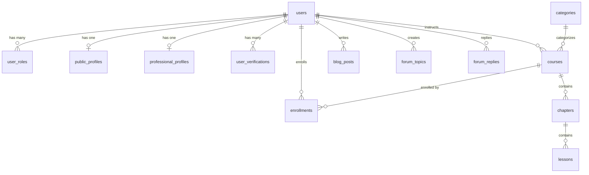

# SYSTEM_OVERVIEW.md — Nền tảng học lập trình tích hợp AI

> **Tài liệu phân tích kỹ thuật toàn diện**
> Dự án: Nền tảng học lập trình tích hợp AI
> Chủ quản: MaiTamDev Team

---

## 1. Tổng quan hệ thống

**MaiTamDev AI Learning** là một nền tảng học lập trình trực tuyến thông minh, tích hợp Trí tuệ nhân tạo (AI). Hệ thống được xây dựng trên nền tảng **Next.js 15** (App Router, Turbopack) kết hợp **Supabase** (PostgreSQL) làm backend-as-a-service, cùng một microservice AI riêng biệt viết bằng **Python FastAPI**.

Hệ thống hướng đến mô hình **kiến trúc phân tán** (distributed architecture) với ba lớp backend chính:

| Thành phần | Công nghệ | Vai trò |
|---|---|---|
| **Main Platform** | Next.js 15 (Vercel) | SSR/CSR, API Routes, UI |
| **Database & Auth** | Supabase (PostgreSQL) | Lưu trữ, RLS, Storage |
| **AI Microservice** | Python FastAPI | Roadmap AI, Code Agent, Face-touch, CV Builder |
| **Media Storage** | Cloudinary | Video, hình ảnh tối ưu hóa |

**Website production:** [https://maitamdev.com](https://maitamdev.com)
**Repository:** [https://github.com/maitamdev/maitam-ai-learning](https://github.com/maitamdev/maitam-ai-learning)

---

## 2. Bài toán và mục tiêu

### 2.1. Bài toán

Các hệ thống E-Learning truyền thống tồn tại nhiều hạn chế:

1. **Thiếu cá nhân hóa:** Không có cơ chế gợi ý khóa học dựa trên hành vi và sở thích người dùng.
2. **Quy trình thủ công:** Điểm danh, giám sát thi cử, cấp chứng chỉ đều yêu cầu can thiệp thủ công.
3. **Thiếu tương tác:** Học viên không có môi trường thực hành code trực tiếp hay hỗ trợ AI khi gặp khó khăn.
4. **Hạn chế gamification:** Thiếu cơ chế tạo động lực học tập thông qua trò chơi hóa.

### 2.2. Mục tiêu

1. Phát triển hệ thống E-Learning hoàn chỉnh với quản lý khóa học đa cấp (Course → Chapter → Lesson).
2. Tích hợp AI gợi ý khóa học (Content-based & Collaborative Filtering).
3. Tích hợp AI để nâng cao trải nghiệm học tập.
4. Xây dựng môi trường code trực tuyến tích hợp Monaco Editor và AI Assistant.
5. Xây dựng môi trường code trực tuyến tích hợp Monaco Editor và AI Assistant.
6. Triển khai Gamification (XP, Streak, Quiz, Leaderboard).
7. Xây dựng hệ thống chứng chỉ số tự động.

---

## 3. Đối tượng người dùng và Use Cases

### 3.1. Phân loại người dùng (Roles)

Hệ thống triển khai RBAC (Role-Based Access Control) với bốn vai trò chính, được lưu trong bảng `user_roles`:

| Vai trò | Mã trong hệ thống | Mô tả |
|---|---|---|
| **Học viên** | `student` | Vai trò mặc định, học tập, làm bài tập, xem lộ trình |
| **Giảng viên** | `instructor` | Tạo và quản lý khóa học, bài học, nội dung |
| **Đối tác** | `partner` | Cộng tác viên, đối tác nội dung |
| **Quản trị viên** | `admin` | Quản lý toàn bộ hệ thống, duyệt nội dung, quản lý người dùng |

Ngoài ra còn phân biệt **membership tier**: `FREE` và `PRO`.

### 3.2. Use Cases chính

**Học viên (Student):**
- Đăng ký/đăng nhập, quản lý profile cá nhân
- Duyệt và tìm kiếm khóa học (lọc theo level, danh mục, giá)
- Ghi danh khóa học, theo dõi tiến độ học tập
- Học bài (xem video, đọc tài liệu Markdown, làm exercises)
- Tương tác Q&A trong bài học
- Sử dụng Code Playground/IDE tích hợp
- Xem lộ trình học tập (Roadmap) trực quan
- Tham gia hệ thống Gamification (Quiz, XP, Streak)
- Nhận chứng chỉ số khi hoàn thành khóa học
- Viết bài viết (Blog/Articles)
- Sử dụng công cụ phụ trợ (CV Builder, Link Shortener, CSS Tools)
- Chat với AI Tutor để được hỗ trợ học tập

**Giảng viên (Instructor):**
- Tạo và quản lý khóa học đa cấp
- Upload video bài giảng (Cloudinary hoặc YouTube)
- Soạn nội dung bài học bằng TipTap/Markdown Editor
- Tạo bài tập (multiple choice, code fill-in)
- Xem thống kê khóa học, số lượng học viên
- Quản lý Professional Profile

**Quản trị viên (Admin):**
- Dashboard tổng quan (thống kê khóa học, người dùng, doanh thu)
- Quản lý người dùng (kích hoạt/vô hiệu hóa, gán vai trò)
- Quản lý khóa học toàn hệ thống
- Duyệt Professional Profile
- Cấu hình hệ thống

---

## 4. Công nghệ sử dụng

### 4.1. Frontend

| Công nghệ | Phiên bản | Vai trò |
|---|---|---|
| **Next.js** | 15.5.4 | Framework chính, App Router, SSR/CSR |
| **React** | 19.1.0 | UI Library |
| **TypeScript** | ^5 | Type safety |
| **Tailwind CSS** | ^4 (v4) | Utility-first CSS |
| **Framer Motion** | ^11.11.17 | Animation library |
| **Radix UI** | Multiple packages | Headless UI components (Dialog, Select, Checkbox, etc.) |
| **Lucide React** | ^0.544.0 | Icon library |
| **shadcn/ui** | ^4.0.0 | Component library dựa trên Radix + Tailwind |
| **next-themes** | ^0.4.6 | Dark/Light mode (hiện forced Light) |
| **cmdk** | ^1.1.1 | Command palette |

### 4.2. State Management & Data Fetching

| Công nghệ | Vai trò |
|---|---|
| **React Context API** | Auth state, Toast notifications, AI Tutor, Learn Course state |
| **Redux Toolkit** | ^2.9.0 — Global state (sẵn sàng sử dụng) |
| **TanStack React Query** | ^5.90.2 — Server state, caching, invalidation |

### 4.3. Rich Content & Editor

| Công nghệ | Vai trò |
|---|---|
| **TipTap** | ^3.10.1 — WYSIWYG editor (bài học, bài viết) |
| **Monaco Editor** | ^4.7.0 — Code editor (IDE tích hợp) |
| **React Markdown** | ^10.1.0 — Render Markdown content |
| **Mermaid** | ^11.12.0 — Biểu đồ trong Markdown |
| **Prism.js** | ^1.30.0 — Syntax highlighting |
| **Recharts** | ^3.5.1 — Data visualization, charts |
| **ReactFlow** | ^11.11.4 — Roadmap flow diagram |

### 4.4. Backend & Database

| Công nghệ | Vai trò |
|---|---|
| **Supabase** (PostgreSQL) | Database chính, Storage, RLS |
| **Next.js API Routes** | Serverless API endpoints |
| **bcryptjs** | ^3.0.2 — Password hashing (OWASP salt rounds: 12) |
| **jsonwebtoken / jose** | JWT generation & verification |
| **Zod** | ^4.1.11 — Schema validation |
| **Cloudinary** | ^2.7.0 — Image/video storage & optimization |

### 4.5. AI Microservice (Python)

| Công nghệ | Vai trò |
|---|---|
| **FastAPI** | 0.115.0 — Web framework |
| **Groq SDK** | 0.15.0 — LLM API (Llama 3) cho AI Roadmap |
| **Ollama** | Local LLM — Code completion & AI chat |
| **MediaPipe** | 0.10.21 — Face mesh / face-touch detection |
| **OpenCV** | 4.11.0 — Computer vision |

### 4.6. Communication & Notification

| Công nghệ | Vai trò |
|---|---|
| **Nodemailer** | ^7.0.10 — Email sending |
| **Resend** | ^6.4.2 — Transactional email |
| **Twilio** | ^5.3.5 — SMS notifications |

### 4.7. Utilities & Others

| Công nghệ | Vai trò |
|---|---|
| **canvas-confetti** | Hiệu ứng celebration |
| **html2canvas / jsPDF** | Xuất chứng chỉ PDF |
| **dagre** | Layout algorithm cho roadmap graph |
| **lz-string** | Nén dữ liệu (IDE auto-save) |
| **nanoid** | ID generation |
| **js-cookie** | Cookie management |
| **axios** | HTTP client |

### 4.8. Deployment

| Thành phần | Nền tảng |
|---|---|
| Frontend | **Vercel** (Tự động deploy từ GitHub) |
| Database | **Supabase Cloud** (PostgreSQL managed) |
| AI Service | **VPS / Google Colab** (Dockerfile sẵn sàng) |
| Media | **Cloudinary CDN** |
| Domain | maitamdev.com |

---

## 5. Kiến trúc hệ thống

### 5.1. Kiến trúc tổng thể

```
┌──────────────────────────────────────────────────────────────────┐
│                     Client Layer (Browser)                       │
│  ┌─────────────┐  ┌──────────────┐  ┌────────────────────────┐  │
│  │  Web App    │  │ Admin Panel  │  │ Code Playground / IDE  │  │
│  │ (React 19)  │  │ (/admin)     │  │ (Monaco + AI Agent)    │  │
│  └──────┬──────┘  └──────┬───────┘  └───────────┬────────────┘  │
└─────────┼────────────────┼──────────────────────┼───────────────┘
          │                │                      │
          ▼                ▼                      ▼
┌──────────────────────────────────────────────────────────────────┐
│                  Next.js 15 App Router (Vercel)                  │
│  ┌────────────┐  ┌──────────────┐  ┌──────────────────────┐     │
│  │ Pages/SSR  │  │  API Routes  │  │    Middleware         │     │
│  │ (app/)     │  │  (app/api/)  │  │ (auth + CORS + route)│     │
│  └────────────┘  └──────┬───────┘  └──────────────────────┘     │
└──────────────────────────┼──────────────────────────────────────┘
                           │
        ┌──────────────────┼──────────────────┐
        ▼                  ▼                  ▼
┌───────────────┐  ┌───────────────┐  ┌───────────────┐
│   Supabase    │  │  AI Service   │  │  Cloudinary   │
│  (PostgreSQL) │  │  (FastAPI)    │  │   (CDN)       │
│               │  │               │  │               │
│ • users       │  │ • /roadmap    │  │ • Videos      │
│ • courses     │  │ • /ollama     │  │ • Images      │
│ • enrollments │  │ • /face-touch │  │ • Avatars     │
│ • lessons     │  │ • /cv         │  │               │
│ • chapters    │  │               │  │               │
│ • blog_posts  │  │ Groq (Llama3) │  │               │
│ • forum_*     │  │ Ollama (Local)│  │               │
│ • user_roles  │  │ MediaPipe     │  │               │
│ • profiles    │  │ OpenCV        │  │               │
└───────────────┘  └───────────────┘  └───────────────┘
```

### 5.2. Mô hình xử lý request

```
Client → Middleware (auth check, CORS, profile routing)
       → API Route Handler (validation, business logic)
       → Supabase Admin Client (database operations)
       → Response (JSON with pagination)
```

### 5.3. Authentication Flow

Hệ thống sử dụng **custom JWT authentication** (không dùng Supabase Auth), kiến trúc như sau:

```
1. Client POST /api/auth/login {email, password}
2. Server: Zod validation → Rate limit check (5/min per IP)
3. Server: Query user from Supabase (supabaseAdmin) → bcrypt.compare()
4. Server: Account lockout check (5 failed → 15 min lock)
5. Server: generateToken(JWT, 7 days) → Set HTTP-only cookie "auth_token"
6. Client: AuthContext.checkAuth() → GET /api/auth/me (cookie-based)
7. Middleware: Verify cookie/Bearer token on protected routes
```

**Tính năng bảo mật đăng nhập:**
- Rate limiting: 5 lần/phút (login), 3 lần/10 phút (register), 3 lần/15 phút (forgot password)
- Account lockout: 5 lần nhập sai → khóa 15 phút
- HTTP-only secure cookie (SameSite: lax)
- bcrypt salt rounds: 12 (OWASP recommended)
- Recovery keys cho khôi phục tài khoản

---

## 6. Cấu trúc codebase

```
aiot_learning_platform/
├── src/
│   ├── app/                          # Next.js App Router
│   │   ├── layout.tsx                # Root layout (ThemeProvider, AuthProvider, ToastProvider)
│   │   ├── page.tsx                  # Homepage
│   │   ├── globals.css               # 43KB - Design system tokens & utilities
│   │   ├── (main)/                   # Route group: main user layout
│   │   ├── admin/                    # Admin panel (dashboard, quản lý)
│   │   │   ├── page.tsx              # Admin dashboard (41KB)
│   │   │   ├── layout.tsx            # Admin layout (sidebar, access control)
│   │   │   ├── lessons/              # Quản lý bài học
│   │   │   └── settings/             # Cài đặt admin
│   │   ├── api/                      # 22 nhóm API routes
│   │   │   ├── auth/                 # 7 endpoints: login, register, logout, me, change-password, forgot-password, recovery-key
│   │   │   ├── courses/              # CRUD khóa học + chapters, enroll, progress, reviews, questions
│   │   │   ├── lessons/              # CRUD bài học + video, content, exercises, complete, questions
│   │   │   ├── ai/                   # 8 endpoints: chat, complete, generate-code, explain-error, review, health, agent, tutor
│   │   │   ├── admin/                # Stats, profile reviews, users, courses-full, sync-stats
│   │   │   ├── profiles/             # Public profiles + activity data
│   │   │   ├── users/                # User management, saved items, password, my-posts
│   │   │   ├── blog/                 # Blog CRUD + comments, likes
│   │   │   ├── cloudinary/           # Upload proxy
│   │   │   ├── upload/               # File upload endpoints
│   │   │   ├── gamification/         # XP, streak, quiz
│   │   │   ├── questions/            # Q&A system
│   │   │   ├── qa/                   # Forum Q&A
│   │   │   ├── roadmap/              # Roadmap data
│   │   │   ├── ai-roadmap/           # AI-generated roadmaps
│   │   │   ├── youtube/              # YouTube video proxy
│   │   │   ├── cv/                   # CV builder API
│   │   │   ├── links/                # Link shortener
│   │   │   ├── exercises/            # Exercise management
│   │   │   ├── chapters/             # Chapter management
│   │   │   ├── face-touch/           # Face-touch detection
│   │   │   └── platform/             # Platform metadata
│   │   ├── auth/                     # Auth pages
│   │   ├── courses/                  # Course listing & detail pages
│   │   ├── learn/                    # Learning view (video, content, sidebar)
│   │   ├── roadmap/                  # 8 sub-routes: visual roadmap + details
│   │   ├── playground/               # Code playground page
│   │   ├── articles/                 # Blog listing & detail
│   │   ├── qa/                       # Q&A forum
│   │   ├── tools/                    # Developer tools suite (6 tools)
│   │   ├── profile/                  # User profile page
│   │   ├── @[username]/              # Public profile (vanity URL)
│   │   ├── settings/                 # User settings
│   │   ├── saved/                    # Saved items
│   │   ├── write/                    # Blog editor
│   │   ├── my-posts/                 # User's blog posts
│   │   ├── discussions/              # Discussions page
│   │   ├── about/                    # About page
│   │   └── contact/                  # Contact page
│   │
│   ├── components/                   # 54+ component files, 14 directories
│   │   ├── ui/                       # 22 shadcn/ui primitives (Button, Input, Dialog, Select...)
│   │   ├── AIAssistant/              # 22 files: AI chat, agent, tutor panels & hooks
│   │   ├── IDE/                      # 12 files: VS Code-like IDE layout
│   │   ├── CodePlayground/           # 7 files: Interactive code sandbox
│   │   ├── gamification/             # 9 files: Quiz, XP toast, streak, level badge
│   │   ├── tools/                    # 29 files: CV builder, CSS grid gen, clip-path, etc.
│   │   ├── Home/                     # Homepage components (HeroBanner, etc.)
│   │   ├── profile/                  # User profile components
│   │   ├── admin/                    # Admin-specific components
│   │   ├── ai/                       # AI feature components
│   │   ├── articles/                 # Blog/article components
│   │   ├── roadmap/                  # Roadmap visualization
│   │   ├── settings/                 # Settings page components
│   │   ├── Header.tsx                # 19KB - Main navigation header
│   │   ├── Footer.tsx                # 19KB - Site footer
│   │   ├── VideoPlayer.tsx           # 40KB - Custom video player (YouTube + direct)
│   │   ├── RoadmapFlow.tsx           # 26KB - ReactFlow roadmap visualization
│   │   ├── CourseReviews.tsx          # 38KB - Course review system
│   │   ├── LoginModal.tsx            # 14KB - Login dialog
│   │   ├── RegisterModal.tsx         # 21KB - Registration dialog
│   │   └── ...                       # 30+ more standalone components
│   │
│   ├── contexts/                     # React Context providers
│   │   ├── AuthContext.tsx           # Authentication state (user, token, login/logout)
│   │   ├── ToastContext.tsx          # Toast notification system
│   │   ├── AITutorContext.tsx        # AI Tutor state management
│   │   └── LearnCourseContext.tsx    # Course learning progress state
│   │
│   ├── lib/                          # 30 utility modules
│   │   ├── supabase.ts              # Supabase client (anon + admin)
│   │   ├── auth.ts                  # JWT helpers (bcrypt, sign, verify)
│   │   ├── db.ts                    # MySQL-to-Supabase compatibility layer (308 lines)
│   │   ├── db-helpers.ts            # Native Supabase query builders (257 lines)
│   │   ├── profile-service.ts       # Unified profile service (1137 lines)
│   │   ├── profile-policies.ts      # Profile authorization policies
│   │   ├── cloudinary.ts            # Image upload/delete/optimize
│   │   ├── ollama.ts                # Ollama LLM client (26KB)
│   │   ├── ai-roadmap-generation.ts # AI roadmap generator
│   │   ├── rateLimit.ts             # In-memory rate limiter
│   │   ├── email.ts                 # Email sending (Nodemailer)
│   │   ├── sms.ts                   # SMS via Twilio
│   │   ├── cv-templates.ts          # CV template definitions
│   │   ├── tool-catalog.ts          # AI agent tool catalog
│   │   ├── agent-tools.ts           # AI agent tool implementations
│   │   ├── video-utils.ts           # Video processing utilities
│   │   ├── validations/             # Zod schemas
│   │   └── hooks/                   # Custom React hooks
│   │
│   ├── types/                        # TypeScript type definitions
│   │   ├── auth.ts                  # User, PublicUser, AuthPayload, ApiResponse
│   │   ├── profile.ts               # AppRole, ProfileBadge, UnifiedProfileResponse (222 lines)
│   │   ├── ai.ts                    # AI chat, completion, Ollama types (194 lines)
│   │   ├── ai-roadmap.ts           # AI roadmap types (18KB)
│   │   ├── cv.ts                    # CV builder types
│   │   └── BlogPost.ts             # Blog post types
│   │
│   ├── middleware.ts                 # Route protection, CORS, profile redirect (171 lines)
│   └── utils/                        # General utilities
│
├── ai-service/                       # Python FastAPI microservice
│   ├── main.py                      # FastAPI app entry point
│   ├── app/
│   │   ├── config.py                # Settings (Groq, Ollama, CORS)
│   │   ├── routers/                 # roadmap, ollama, face_touch, cv
│   │   ├── services/                # Business logic services
│   │   ├── models/                  # Pydantic models
│   │   └── prompts/                 # LLM prompt templates
│   ├── requirements.txt             # Python dependencies
│   └── Dockerfile                    # Container deployment
│
├── mobile/                           # React Native mobile app (planned)
├── scripts/                          # Admin scripts (grant-role, check-roles)
└── public/                           # Static assets
```

---

## 7. Các module chức năng

### 7.1. Module Quản lý Khóa học (Course Management)

**Cấu trúc dữ liệu:** Course → Chapter → Lesson (3 cấp)

- **CRUD khóa học:** Tạo, sửa, xóa, publish/unpublish
- **Danh sách khóa học:** Phân trang, lọc (level, giá, danh mục), tìm kiếm full-text
- **Landing page khóa học:** Video trailer, mô tả, review, thông tin giảng viên
- **Ghi danh:** Enroll/unenroll, theo dõi tiến độ
- **API:** RPC functions (`get_courses_with_details`, `count_courses_with_filters`) — Sử dụng PostgreSQL stored procedures cho JOIN phức tạp
- **Caching:** `Cache-Control: public, max-age=30, stale-while-revalidate=120`

### 7.2. Module Nội dung Bài học (Lesson Content)

- **Video player:** Custom player hỗ trợ YouTube embed + direct upload (Cloudinary), 40KB component
- **Content editor:** TipTap WYSIWYG editor với extensions (Code Block, Image, Link, Placeholder)
- **Video upload:** Cloudinary integration, validation, multiple sources
- **Lesson completion:** Mark complete, progress tracking
- **Exercises:** Multiple choice quiz, code fill-in
- **Q&A:** Hỏi đáp trong bài học, nested replies

### 7.3. Module Quản lý Người dùng (User Management)

- **Đăng ký:** Email + password, Zod validation, recovery keys
- **Đăng nhập:** JWT (7 ngày), HTTP-only cookie, rate limiting
- **Profile:** Unified Profile System — Public Profile + Professional Profile
- **Roles:** Bảng `user_roles` riêng biệt, hỗ trợ nhiều vai trò/người dùng
- **Verification:** Instructor/Partner verification workflow
- **Badges:** `verified_instructor`, `verified_partner`
- **Settings:** Change password, update profile, social links

### 7.4. Module Lộ trình Học tập (Roadmap)

- **Visualization:** ReactFlow + dagre layout cho flow diagram
- **Tree view:** Hiển thị lộ trình theo cấu trúc cây
- **Node detail:** Sidebar chi tiết kiến thức, liên kết bài học
- **AI Roadmap:** Tạo lộ trình tự động bằng Groq (Llama 3)

### 7.5. Module AI Assistant

- **Code Completion:** Ollama (deepseek-coder:1.3b) — FIM (Fill-in-Middle)
- **AI Chat:** Ollama (qwen2.5-coder:7b-instruct) — Chat with code context
- **AI Tutor:** Context-aware tutoring panel, FAB button
- **AI Agent:** Tool-based agent (read_code, edit_code tools)
- **Code Generation:** Generate code from natural language
- **Error Explanation:** Explain errors and suggest fixes
- **Code Review:** AI-powered code review
- **22 component files** + 4 custom hooks (`useAIChat`, `useAIAgent`, `useAIAgentChat`, `useAITutorChat`)

### 7.6. Module IDE / Code Playground

- **VS Code-like layout:** ActivityBar, TabBar, EditorPanel, BottomPanel, StatusBar, TitleBar
- **Monaco Editor:** Full editor với syntax highlighting, IntelliSense
- **Auto-save:** `lz-string` compression, localStorage persistence
- **AI integration:** Inline completions, chat panel

### 7.7. Module Gamification

- **Quiz:** Multiple choice (`QuizMultipleChoice.tsx`), Code fill-in (`QuizCodeFill.tsx`)
- **XP System:** XP reward toast, level badge
- **Streak:** Learning streak indicator, streak tracking
- **Chapter Summary:** Performance summary after completing chapters
- **Confetti:** `canvas-confetti` cho celebrations

### 7.8. Module Blog / Articles

- **CRUD:** Tạo, sửa, xóa, publish bài viết
- **Editor:** TipTap / Markdown Editor
- **Social:** Likes, comments, saved articles
- **My Posts:** Quản lý bài viết cá nhân

### 7.9. Module Developer Tools

6 công cụ tiện ích dành cho developer:

1. **CV Builder** — Tạo CV với AI suggestions (11 components)
2. **CSS Grid Generator** — Visual CSS grid builder (7 components)
3. **Clip-path Maker** — CSS clip-path visual editor (8 components)
4. **Link Shortener** — URL shortening service
5. **Snippet Generator** — Code snippet creator
6. **Face-touch Alert** — AI face-touch detection (MediaPipe)

### 7.10. Module Admin Panel

- **Dashboard:** Thống kê tổng quan (41KB page component)
- **User management:** Danh sách, kích hoạt/vô hiệu, gán vai trò
- **Course management:** Quản lý toàn bộ khóa học
- **Profile reviews:** Duyệt Professional Profile
- **Settings:** Cấu hình hệ thống
- **Stats sync:** Đồng bộ thống kê

---

## 8. Các luồng xử lý chính

### 8.1. Luồng Đăng ký / Đăng nhập / Phân quyền

```
[Đăng ký]
1. User nhập email, password, username, full_name
2. POST /api/auth/register → Zod validation
3. Rate limit check (3/10min) → bcrypt.hash(password, 12)
4. INSERT vào bảng "users" (Supabase) → Tạo recovery keys
5. Response: success + recovery keys (hiển thị modal để user lưu)

[Đăng nhập]
1. User nhập email, password
2. POST /api/auth/login → Zod validation → Rate limit (5/min)
3. Kiểm tra account lockout → bcrypt.compare()
4. Thất bại: increment failed_login_attempts, lock nếu ≥ 5
5. Thành công: jwt.sign({userId, email, username, membership_type}, 7d)
6. Set cookie "auth_token" (httpOnly, secure, sameSite: lax)
7. Client: AuthContext.checkAuth() → GET /api/auth/me

[Phân quyền]
1. Middleware kiểm tra token (cookie hoặc Bearer header)
2. Protected routes: /learn, /admin, /settings, /api/lessons, /api/chapters
3. API routes: verifyToken() → extractAuthPayload → getAuthUserById()
4. Role check: fetchActiveRoles() từ bảng user_roles
5. Admin panel: layout.tsx kiểm tra role === "admin"
```

### 8.2. Luồng CRUD Khóa học

```
[Tạo khóa học - Instructor/Admin]
1. POST /api/courses/[slug] → Auth check → Role check
2. Insert khóa học → Tạo chapters → Tạo lessons
3. Upload thumbnail (Cloudinary) → Update course record

[Học viên xem khóa học]
1. GET /api/courses → RPC get_courses_with_details (JOIN users, categories)
2. Phân trang server-side (p_limit, p_offset) + Cache-Control headers
3. GET /api/courses/[slug] → Chi tiết + chapters + lessons count

[Ghi danh]
1. POST /api/courses/[slug]/enroll → Auth check
2. Insert enrollments record → Return enrollment status
3. Progress tracking: lessons completed / total lessons
```

### 8.3. Luồng Upload/Download File

```
[Upload hình ảnh - Avatar, Thumbnail]
1. Client: FormData → POST /api/cloudinary (hoặc /api/upload)
2. Server: Cloudinary SDK uploadImage(buffer, folder)
3. Cloudinary: Auto quality, auto format optimization
4. Response: secure_url → Update record trong Supabase

[Upload video bài giảng]
1. Client: File selection → POST /api/lessons/[id]/video
2. Server: Upload to Cloudinary (resource_type: video)
3. Alternative: YouTube URL → Validate → Store URL
4. Video player: Custom component hỗ trợ cả hai nguồn
```

### 8.4. Luồng Tìm kiếm / Lọc / Phân trang

```
GET /api/courses?level=BEGINNER&is_free=1&category=web&search=react&page=1&limit=12

→ RPC get_courses_with_details(p_level, p_is_free, p_category_slug, p_search, p_limit, p_offset)
→ RPC count_courses_with_filters(same params) → pagination metadata
→ Response: { courses: [...], pagination: { total, page, limit, totalPages, hasMore } }
```

### 8.5. Luồng AI Assistant

```
[Code Completion]
1. User typing → Trigger after delay (300ms)
2. POST /api/ai/complete → { prefix, suffix, language }
3. Ollama FIM prompt → deepseek-coder:1.3b
4. Stream response → Inline ghost text

[AI Chat / Tutor]
1. User message → POST /api/ai/chat (hoặc /api/ai/tutor)
2. Messages + code context → Ollama qwen2.5-coder:7b
3. Streaming SSE response → Real-time rendering
4. Tool calls: read_code, edit_code → Agent loop

[AI Roadmap Generation]
1. User request → POST /api/ai-roadmap
2. Next.js proxy → Python FastAPI /roadmap endpoint
3. Groq Llama 3 → Structured roadmap JSON
4. Response → ReactFlow visualization
```

---

## 9. Thiết kế cơ sở dữ liệu

### 9.1. Database chính (Supabase PostgreSQL)

Dựa trên phân tích source code, hệ thống bao gồm các bảng sau:

#### Nhóm User & Auth

| Bảng | Cột chính | Mô tả |
|---|---|---|
| `users` | id (UUID PK), email, password_hash, username, full_name, avatar_url, phone, bio, membership_type (FREE/PRO), membership_expires_at, learning_streak, total_study_time, is_active, is_verified, last_login, failed_login_attempts, locked_until, role, created_at, updated_at | Bảng người dùng chính |
| `user_roles` | user_id (FK), role (student/instructor/partner/admin), revoked_at | Hỗ trợ nhiều vai trò/người dùng |
| `user_verifications` | user_id (FK), verification_type, status, requested_at, reviewed_at, review_notes | Xác minh giảng viên/đối tác |
| `public_profiles` | user_id (FK, unique), display_name, headline, bio, avatar_url, banner_url, location, website_url, social_links (JSONB) | Profile công khai |
| `professional_profiles` | user_id (FK, unique), profile_roles (JSONB), status, headline, summary, years_experience, current_title, current_organization, location, skills (JSONB), education_items (JSONB), career_items (JSONB), achievement_items (JSONB), featured_links (JSONB), submitted_at, reviewed_at, published_at, review_notes | Profile chuyên nghiệp |

#### Nhóm Course & Learning

| Bảng | Cột chính | Mô tả |
|---|---|---|
| `courses` | id, title, slug, short_description, thumbnail_url, level (BEGINNER/INTERMEDIATE/ADVANCED), price, is_free, is_published, rating, total_students, total_lessons, estimated_duration, instructor_id (FK→users), category_id, created_at | Khóa học |
| `categories` | id, name, slug | Danh mục khóa học |
| `chapters` | id, course_id (FK), title, order_index | Chương trong khóa học |
| `lessons` | id, chapter_id (FK), title, content, video_url, order_index | Bài học |
| `enrollments` | id, user_id (FK), course_id (FK), progress_percentage, enrolled_at, completed_at | Ghi danh & tiến độ |

#### Nhóm Content & Social

| Bảng | Cột chính | Mô tả |
|---|---|---|
| `blog_posts` | id, user_id, title, slug, content, status (draft/published), published_at, views_count, likes_count, comments_count | Bài viết/Blog |
| `forum_topics` | id, user_id, title, content | Chủ đề thảo luận |
| `forum_replies` | id, topic_id, user_id, content | Trả lời thảo luận |

#### PostgreSQL Functions (RPC)

Hệ thống sử dụng stored procedures cho các query phức tạp:
- `get_courses_with_details(p_limit, p_offset, p_level, p_is_free, p_category_slug, p_search)` — JOIN courses + users + categories
- `count_courses_with_filters(...)` — Đếm tổng khóa học theo điều kiện

### 9.2. Quan hệ giữa các bảng



---

## 10. Cơ chế bảo mật và phân quyền

### 10.1. Authentication

| Cơ chế | Chi tiết |
|---|---|
| **Password hashing** | bcrypt, salt rounds = 12 (OWASP recommended) |
| **JWT Token** | jsonwebtoken, 7 ngày expiry, HTTP-only cookie |
| **Session management** | Stateless JWT, cookie-based cho web, Bearer token cho mobile |
| **Rate limiting** | In-memory Map, per-IP, configurable windows |
| **Account lockout** | 5 lần sai → khóa 15 phút, auto-reset sau lockout hết |
| **Recovery keys** | Mảng keys sinh ngẫu nhiên khi đăng ký, dùng khôi phục tài khoản |

### 10.2. Authorization

| Layer | Cơ chế |
|---|---|
| **Middleware** | Kiểm tra token cho protected routes (/learn, /admin, /api/lessons...) |
| **API Route** | `verifyToken()` + `getAuthUserById()` → Check roles |
| **Profile policies** | `canViewProfessionalProfile()`, `canEditProfessionalProfile()`, `canPublishProfessionalProfile()` |
| **Supabase RLS** | Row Level Security policies trên database (hạ tầng sẵn sàng, API routes dùng admin client bypass) |

### 10.3. Các biện pháp bảo mật khác

- **CORS:** Middleware cấu hình riêng, hỗ trợ mobile app (React Native)
- **Input validation:** Zod schema validation cho mọi API input
- **SQL injection prevention:** Supabase query builder (parameterized queries)
- **XSS prevention:** React auto-escaping, HTTP-only cookies
- **Security headers:** `poweredByHeader: false` trong Next.js config

---

## 11. Triển khai và vận hành

### 11.1. Môi trường phát triển

```bash
# Cài đặt dependencies
pnpm install

# Chạy dev server (Turbopack)
pnpm dev          # Next.js: http://localhost:3000

# AI Service
cd ai-service
pip install -r requirements.txt
python main.py    # FastAPI: http://localhost:8000
```

### 11.2. Biến môi trường

| Biến | Mục đích |
|---|---|
| `NEXT_PUBLIC_SUPABASE_URL` | Supabase project URL |
| `NEXT_PUBLIC_SUPABASE_ANON_KEY` | Supabase anon key (client-side) |
| `SUPABASE_SERVICE_ROLE_KEY` | Supabase service role (server-side, bypass RLS) |
| `JWT_SECRET` | Secret cho JWT signing |
| `CLOUDINARY_CLOUD_NAME/API_KEY/API_SECRET` | Cloudinary credentials |
| `GROQ_API_KEY` | Groq API key cho AI Roadmap |
| `OLLAMA_BASE_URL` | Ollama server URL |
| `TWILIO_ACCOUNT_SID/AUTH_TOKEN` | Twilio SMS credentials |

### 11.3. Production deployment

- **Frontend:** Vercel (auto-deploy từ GitHub main branch)
- **AI Service:** Docker container trên VPS (hoặc Google Colab cho demo)
- **Database:** Supabase Cloud (PostgreSQL managed, auto backups)
- **CDN:** Cloudinary (auto-optimize images/videos)

---

## 12. Đánh giá kỹ thuật: ưu điểm, hạn chế, hướng cải tiến

### 12.1. Ưu điểm

1. **Kiến trúc hiện đại:** Next.js 15 App Router + Turbopack, React 19, TypeScript strict mode — đảm bảo developer experience và performance tối ưu.

2. **Backend-as-a-Service:** Supabase giảm đáng kể thời gian phát triển backend, cung cấp PostgreSQL managed, RLS, Storage, và real-time sẵn sàng.

3. **AI Microservice tách biệt:** Python FastAPI cho AI/ML cho phép sử dụng hệ sinh thái Python phong phú (MediaPipe, OpenCV, Groq) mà không ảnh hưởng Next.js runtime.

4. **Bảo mật nhiều lớp:** Rate limiting, account lockout, bcrypt (OWASP), HTTP-only cookies, Zod validation, CORS configuration, recovery keys.

5. **Unified Profile System:** Kiến trúc profile phức tạp (public + professional) với verification workflow, badges, role-based visibility — thể hiện tư duy thiết kế hệ thống mature.

6. **Code Playground / IDE:** Tích hợp Monaco Editor với AI-powered completions, tạo trải nghiệm coding thực tế ngay trên browser.

7. **Developer Tools Suite:** 6 công cụ tiện ích (CV Builder, CSS Tools, etc.) tăng giá trị nền tảng.

8. **Responsive & Media-rich:** Tailwind CSS v4, Framer Motion animations, custom Video Player hỗ trợ đa nguồn.

### 12.2. Hạn chế

1. **Custom Auth thay vì Supabase Auth:** Hệ thống tự implement JWT auth thay vì dùng Supabase Auth built-in. Điều này tăng code cần maintain và có thể thiếu một số tính năng (OAuth, MFA) mà Supabase Auth cung cấp sẵn.

2. **In-memory Rate Limiter:** Rate limiting dùng `Map` trong bộ nhớ — không hoạt động khi scale nhiều instances. Cần chuyển sang Redis-based solution cho production scale.

3. **MySQL compatibility layer:** `db.ts` (308 lines) parse SQL string để convert sang Supabase queries — fragile và khó maintain. Đây là legacy từ quá trình migration từ MySQL.

4. **TypeScript/ESLint warnings bị tắt:** `ignoreBuildErrors: true` và `ignoreDuringBuilds: true` trong `next.config.ts` — che giấu potential bugs.

5. **Theme bị forced light:** `forcedTheme="light"` — Dark mode chưa hoàn thiện mặc dù cơ sở hạ tầng (`next-themes`) đã có.

6. **Thiếu automated testing:** Không thấy test framework (Jest, Vitest, Playwright) trong dependencies — chưa có unit/integration/E2E tests.

7. **Admin panel monolithic:** `admin/page.tsx` (41KB) — quá lớn cho một file, cần refactor thành components nhỏ hơn.

8. **API routes thiếu middleware tái sử dụng:** Mỗi route tự handle auth check riêng thay vì có shared middleware/decorator pattern.

### 12.3. Hướng cải tiến

1. **Chuyển sang Supabase Auth:** Tận dụng OAuth providers (Google, GitHub), MFA, email verification built-in, giảm code auth tự viết.

2. **Redis Rate Limiting:** Thay `Map` bằng Redis (Upstash Redis serverless) cho rate limiter hoạt động đúng khi scale.

3. **Loại bỏ MySQL compat layer:** Refactor tất cả queries sang native Supabase query builder hoặc PostgreSQL RPC functions, xóa `db.ts`.

4. **Enable TypeScript strict checks:** Bật lại type checking trong build, fix tất cả type errors.

5. **Automated Testing:** Thêm Vitest cho unit tests, Playwright cho E2E tests.

6. **API Middleware Pattern:** Tạo higher-order function `withAuth()` wrapper cho API routes.

7. **Dark Mode:** Hoàn thiện dark mode theme đã có cơ sở hạ tầng.

8. **Real-time Features:** Tận dụng Supabase Realtime cho notifications, chat, live progress updates.

9. **Mobile App:** Hoàn thiện React Native app (thư mục `mobile/` đã tồn tại).

10. **Payment Integration:** Tích hợp cổng thanh toán (VNPay, MoMo) cho khóa học trả phí.

11. **CI/CD Pipeline:** GitHub Actions cho automated testing, linting, và deployment.

12. **Performance Monitoring:** Tích hợp Sentry hoặc Vercel Analytics cho error tracking và performance monitoring.

---

> **Ghi chú:** Tài liệu này được tạo bằng cách phân tích trực tiếp source code của dự án. Một số thông tin về database schema được suy luận từ TypeScript types và Supabase queries trong code, không phải từ migration files. Các bảng và cột được liệt kê là những bảng có bằng chứng rõ ràng trong source code; có thể tồn tại thêm các bảng phụ trợ khác trong Supabase project.
